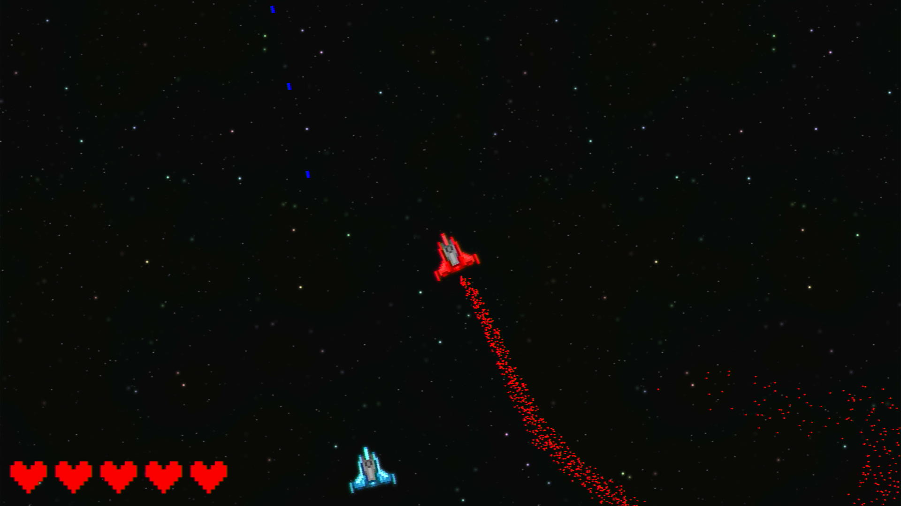
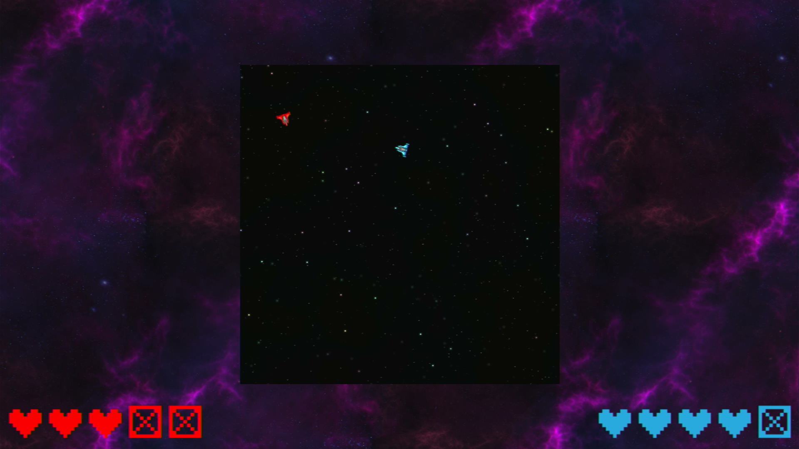
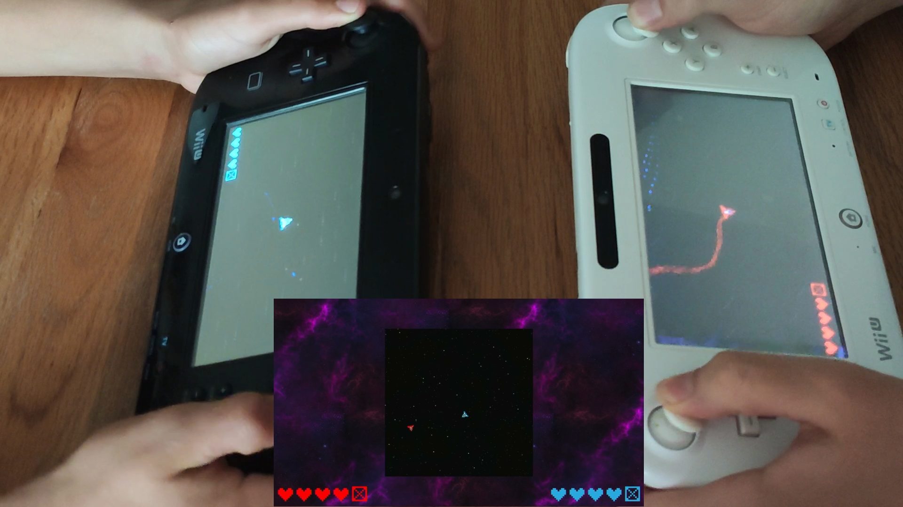
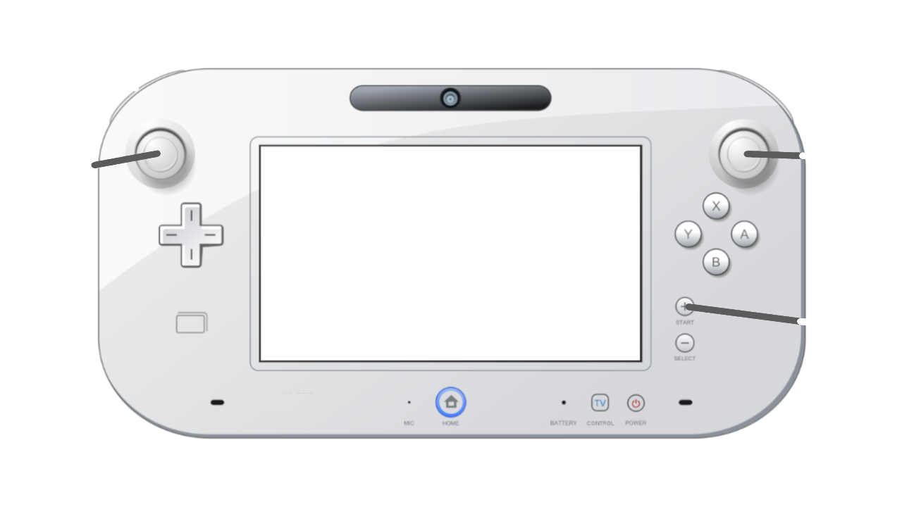
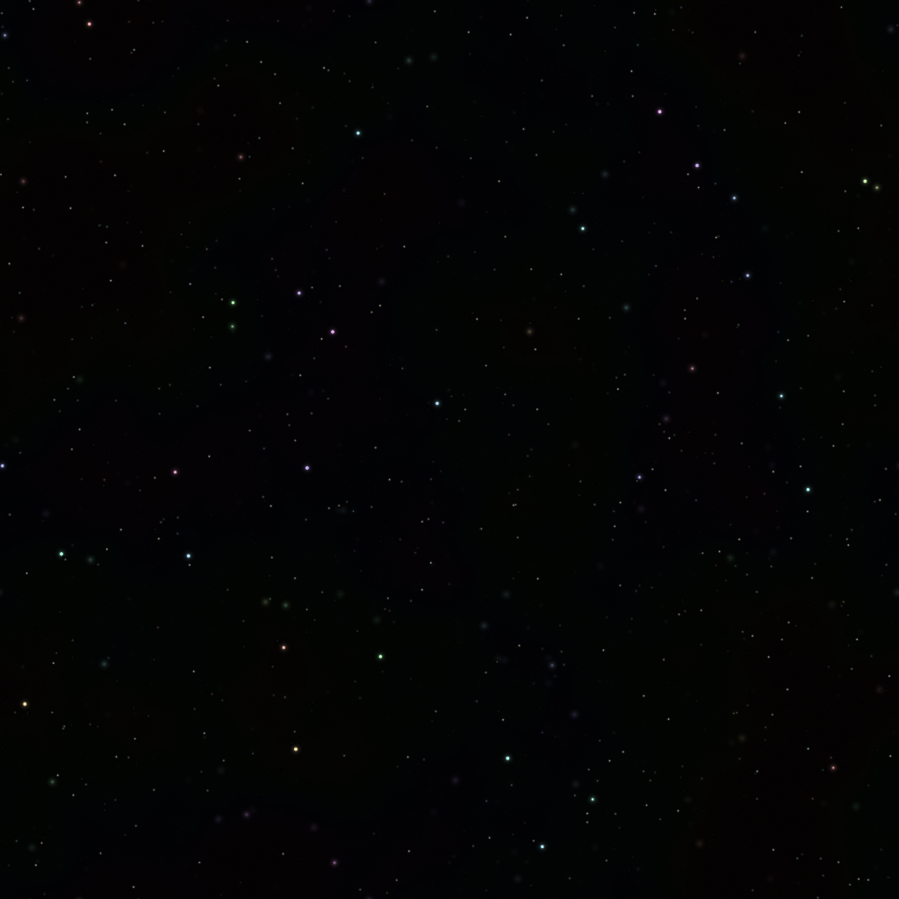
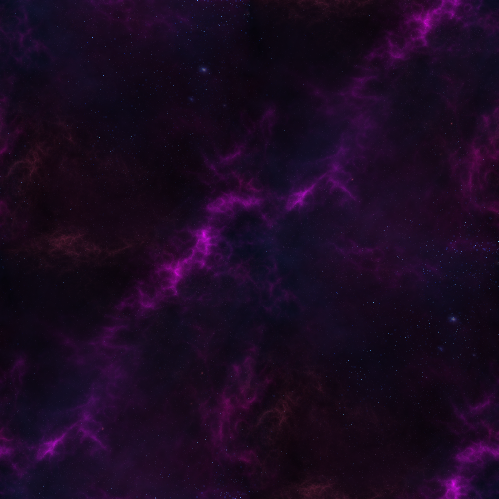

# MultiDRCSpaceDemo
A space shooter demo using the Wii U's MultiDRC mode.  

The Wii U has an unused feature allowing two GamePads to be connected to a single console.  
Nintendo [announced this back at the E3 2012](https://www.polygon.com/gaming/2012/6/5/3065588/wii-u-supports-two-gamepads-nintendo-confirms) before the Wii U was released.  
While this feature was never released it is still in the system files and can be used by homebrew applications.  
This project acts as a small demo and example for using that MultiDRC mode. 

## Screenshots

## Controls

## Assets
### Seamless Space Backgrounds - Screaming Brain Studios

### Pixel Spaceship - dsonyy

### Wii U controller illustration - Tokyoship

## Building
To build this application you need devkitPPC and the dependencies below.  
Get started with installing the toolchain [here](https://devkitpro.org/wiki/Getting_Started).  
Then run `make`.

### Dependencies
- [wut](https://github.com/devkitPro/wut)  
  Note that the wut releases are currently missing PR [#263](https://github.com/devkitPro/wut/pull/263), [#264](https://github.com/devkitPro/wut/pull/264), [#265](https://github.com/devkitPro/wut/pull/265), [#266](https://github.com/devkitPro/wut/pull/266) which are required to build this project.
- ppc-glm
- ppc-libpng
- ppc-freetype

To install the dependencies run `(dkp-)pacman -S wut ppc-glm ppc-libpng ppc-freetype`

